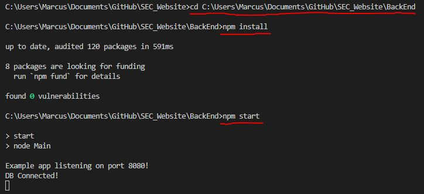

# SEC_Website

## Welcome to Mech-Shop!

This is the user manual for you to get to know our website and how to use it!

### Getting Started
To begin using our site, there are a few things to install:
* WampServer (https://www.wampserver.com/en/)
* MySQL Workbench (https://www.mysql.com/products/workbench/)
* A text editor (such as Visual Studio Code or Intellij)

#### WampServer:

Once you have Wamp installed, open it and you should see the WampServer running in your taskbar.

If the Wamp symbol is red, click on Wamp and select _Start All Services_.

Once doing so, the Wamp symbol will turn green.

From there, click on the Wamp symbol again and hover over the MySQL option.

select the _my.ini_ option and open it in a text editor.

Once you have opened _my.ini_ in a text editor, find every instance where it says "_port =_" followed by a number.
Ensure that all instances are changed to "_port =3308_".

Save the file once all ports are changed to _3308_.

Ensure that the WampServer is still up and running.

#### MySQL Workbench:
After you have finished setting up the WampServer and it is up and running, open MySQL Workbench.
Select the local Wamp instance. You should see that the _localhost:_ has the port _3308_ if you have edited and saved _my.ini_ correctly from the previous step.

After selecting the local instance, create a new SQL schema and name it _sec_website_

Select _Apply_ on the bottom right and an extra window will pop up with more options. Under _Online DDL Algorithm_ and _Lock Type_ options, leave them as _Default_ and click _Apply_ on the bottom right.

Once you have created the _sec_website_ schema, in the top menu, select _Server_, then _Data Import_

The menu should look as follows:

* Select _Import from Self-Contained File, go to where you saved the SEC_Website files and select the file _DBDump.sql_
* Next to _Default Target Schema:_ select the _sec_website_ schema you created.
* Then select _Start Import_ on the bottom right

If done correctly, you should now see the different tables on the right under the _sec_website_ schema and no error messages under data import:

Congratulations you are almost ready to start up our site!

#### Final steps:

Now that you have the WampServer and MySQL Workbench up and running, open up the SEC_Website in a text editor and open up two terminal sessions. 

For terminal session 1:
* Change the directory to C: ...\SEC_Website\BackEnd
* Then do _npm_install_
* Then do _npm_start_
This ensures the application is connected to the database.
The output should look like so:

For terminal session 2:
* Change the directory to C: ...\SEC_Website\sec_website
* Then do _npm install --legacy-peer-deps_
* Then do _npm start_
This starts the react js session.
The output should look like so (no need to worry about the vulnerabilities):

...and that's it! You may now access the SEC_Website!

### Login
When using our site, you will come across our login page first:

The user credentials are:
* Username: _user_
* Password: _password_

### Browse Catalogue and Adding Items to Shopping Cart
Once logged in you will be taken to our keyboard catalogue page:

* If you want more information on a product, just click on the product name
* If you are done browsing a particular product and want to return to the main catalogue, just select **Home** in the menu

When you wish to add an item to cart you may either, just select the **ADD TO CART** button located below each item in the catalogue.

Once you have added the item to cart, you may check your shopping cart by selecting _Cart_ in the top menu. There will also be a small red number to indicate how many items are in your shopping cart.

You can choose to remove items by selecting the _Remove_ button, or go back to the catalogue by pressing _Home_ in the top menu.

Once you are happy with you items, you may proceed to checkout by selecting _Go to checkout!_ in the shopping cart.

### Checkout and Payment

Our site supports Google Pay for an easier payment experience!

Enter your details as required. Once you have entered all your details, the Google Pay option will appear.

Follow the Google Pay prompts and proceed with payment!

